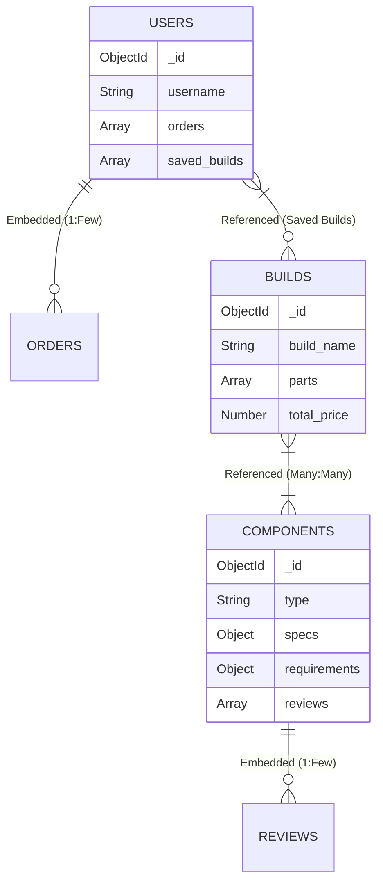
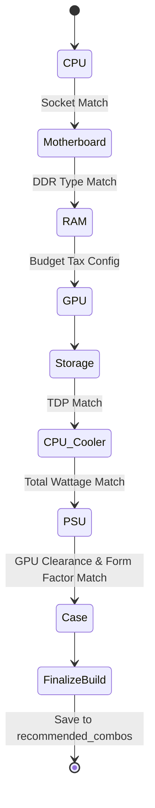

<h1 align="center">MongoPcPartPicker (PC Part Builder)</h1>

<p align="center">
  <i>An advanced MongoDB-based intelligent hardware catalog and interactive PC builder system.</i>
</p>

<p align="center">
  
  
  
  
</p>

<br />

---

## Table of Contents

- [Overview](#overview)
- [Key Features](#key-features)
- [System Architecture & Data Modeling](#system-architecture--data-modeling)
  - [Hybrid Schema Design](#hybrid-schema-design)
  - [Polymorphic Pattern](#polymorphic-pattern)
- [Core Engines](#core-engines)
  - [ETL Pipeline (data.js)](#etl-pipeline-datajs)
  - [Interactive PC Builder](#interactive-pc-builder)
- [Advanced Analytics](#advanced-analytics)
  - [Aggregation Pipelines](#aggregation-pipelines)
  - [MapReduce Statistics](#mapreduce-statistics)
- [Getting Started](#getting-started)
- [Team and License](#team-and-license)

---

## Overview

### The Concept
Building a custom PC involves strict compatibility rules—matching CPU sockets to motherboards, verifying cases have enough GPU clearance, and ensuring the power supply can handle the hardware's total wattage (TDP). 

**MongoPcPartPicker** is a comprehensive NoSQL database project that models a real-world e-commerce hardware store. Using a dataset of over **45,000 real-world PC components**, it features an intelligent, interactive PC building engine written entirely in MongoDB shell scripts (ES5 JavaScript).

### The Solution
Instead of relying on a traditional backend, the system leverages native MongoDB capabilities:
- **`$lookup` Self-Joins** and Aggregations to filter compatible parts on the fly.
- **Dynamic Tier Enforcement** to match high-end CPUs with appropriately rated complementary components.
- **Fallbacks & Surplus Taxes** to intelligently manage the user's budget.

---

## Key Features

| Feature | Description | Tech Highlight |
|:---|:---|:---|
| **Real-World ETL** | Imports, cleans, and transforms ~46k raw components into a unified NoSQL schema. | JS Regex, Text Normalization |
| **Interactive Builder** | A state-machine CLI builder filtering parts by physical and budget constraints. | State Machine, Interactive CLI |
| **Smart Compatibility** | Auto-detects socket types, RAM generation (DDR4/DDR5), and GPU clearances. | `$match`, Complex Queries |
| **Tier Enforcement** | Prevents budget bottlenecks by enforcing quality "Tiers" (Entry, Mid, High, Enthusiast). | Dynamic `$group`, Math Operators |
| **Self-Join Queries** | Finds matching components (e.g., Mobo to CPU) within the same generic `components` collection. | `$lookup` on same collection |
| **Budget Fallbacks** | Allows up to 10% budget tolerance and auto-downgrades tiers if funds are low. | Algorithmic Fallbacks |
| **Market Analytics** | Analyzes brand dominance and estimates hardware market values. | Aggregation Pipeline |
| **Legacy Mining** | Uses `MapReduce` to extract deep statistics like "Best Builds Per Tier". | `mapReduce` |

---

## System Architecture & Data Modeling

The database uses a carefully balanced **Hybrid NoSQL Schema**, mixing embedded and referenced data strategies to optimize read/write performance.

### Hybrid Schema Design



- **Embedded Arrays**: User `orders` and Component `reviews` are embedded. This avoids expensive DB joins for data that exclusively belongs to its parent.
- **Referenced Documents**: `builds` use ObjectIds to refer to `components` (`Many-to-Many`). This ensures that if a CPU's price updates, all builds utilizing that CPU instantly reflect the new price.

### Polymorphic Pattern
All PC parts (CPU, GPU, Case, etc.) live in a single `components` collection. Using the **Polymorphic Pattern**, they share base properties (`name`, `price`, `manufacturer`), but hold unique dynamic fields inside a generic `specs` and `requirements` object.

---

## Core Engines

### ETL Pipeline (`data.js`)
Handles **E**xtraction, **T**ransformation, and **L**oading:
1. Loads 8 raw JSON categories (Cases, CPUs, GPUs, etc.).
2. Normalizes strings and parses nested arrays (e.g., `2000GB` -> `2TB`).
3. Uses Advanced Regex to glean Socket definitions directly from string names (e.g., identifying `LGA1700` from `"Intel Core i9-14900K"`).

### Interactive PC Builder
Operates completely inside `mongosh`. Users trigger it via `startBuild(budget, usage)` and navigate using `pick(X)`.



---

## Advanced Analytics

### Aggregation Pipelines (`section6`)
- **Market Analysis**: Uses `$group` and arithmetic operators (`$multiply`, `$round`) to estimate total market value for each hardware category.
- **Multi-level Breakdown**: Uses consecutive `$group` stages to map out manufacturers and their nested product sub-categories without needing an external JOIN.

### MapReduce Statistics (`section7`)
Implemented 3 MapReduce flows to demonstrate distributed data processing concepts:
1. **Best Builds per Tier**: Emits dynamic price tiers, reduces by picking the maximum benchmark score (with price tie-breakers), and outputs a curated list of top-value setups.
2. **Manufacturer Stats**: Maps hardware `> $200` to find premium market dominance.
3. **Rating Distribution**: Safely processes embedded `reviews` arrays to aggregate star-rating distributions.

---

## Getting Started

### Prerequisites
- [MongoDB](https://www.mongodb.com/try/download/community) installed and running locally.
- MongoDB Shell (`mongosh`).
- PowerShell or standard Terminal.

### Setup Instructions

1. **Clone and Enter the Directory**
   ```bash
   cd MongoPcPartPicker
   ```

2. **Launch the MongoDB Shell**
   ```bash
   mongosh
   ```

3. **Load the Project**
   Inside the `mongosh` terminal, load the main script:
   ```javascript
   load("project.js")
   ```

4. **Run the Interactive Builder**
   Start building a PC with a $1500 budget tailored for gaming:
   ```javascript
   startBuild(1500, 'gaming')
   ```
   Follow the prompts and select your parts using `pick(index)`!

### Other Commands
- Run queries analysis: `section4_queries()`
- Run Updates & Deletes: `section5_updatesAndDeletes()`
- Generate Aggregations: `section6_marketAnalysis()`
- Launch MapReduce Analytics: `section7_mapReduce()`

---

## Team and License

**Created By:** Moty Sakhartov, Ron Blanki, Idan Dahan  
**Scope:** Final Database Project, Advanced MongoDB Architecture  

**License**: Academic Project. Prepared for demonstrative and academic evaluation. All raw hardware data belongs to their respective owners (e.g., PCPartPicker). No commercial use intended.
